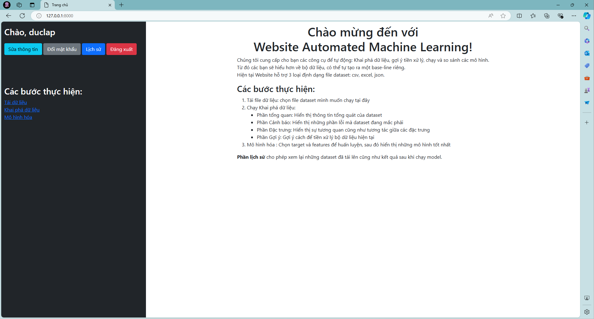
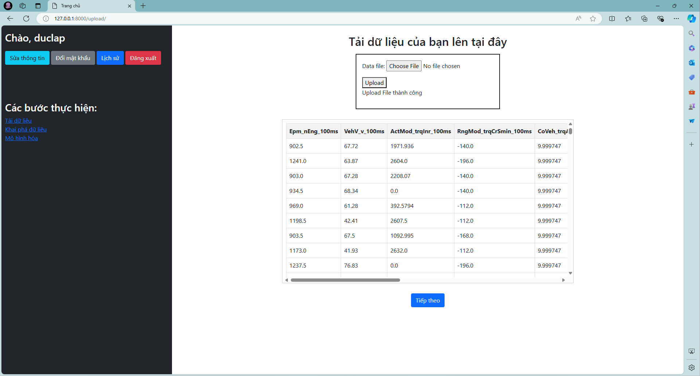
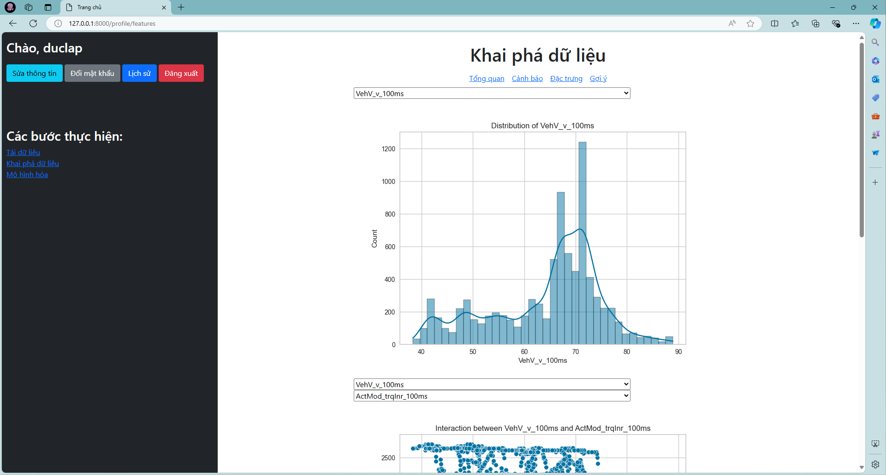
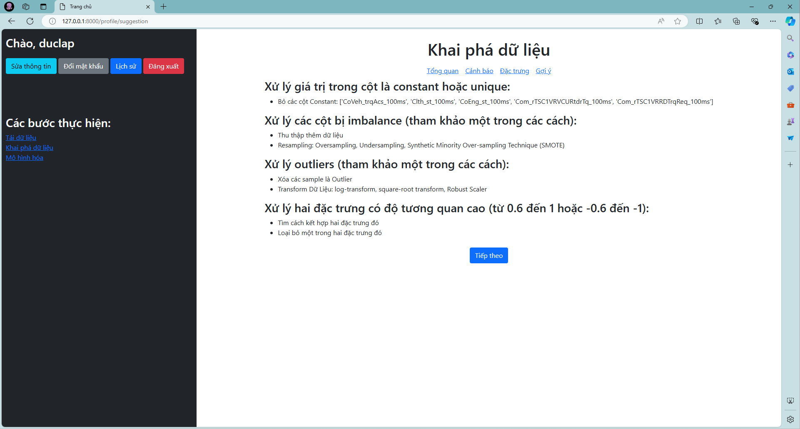
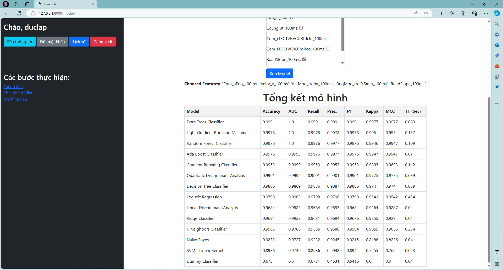
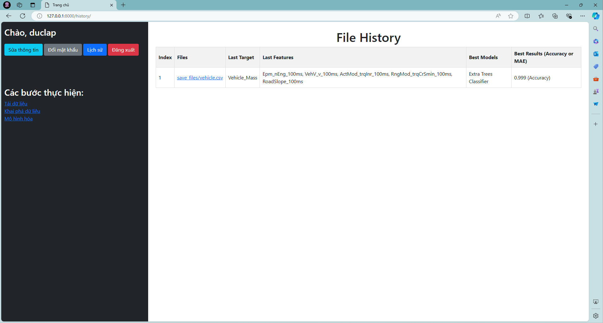

<!-- Title -->
<h1><b>WEBSITE AUTOMATED MACHINE LEARNING</b></h1>
<!-- Descriptoin -->
<p>This is a website that helps automate basic processes of machine learning (such as EDA, Feature Engineering, Modeling, etc.) with simple text or numeric datasets.
That helps find baseline of the machine learning task.
</p>
<h3><b>Technology use:</b> Django, PyCaret, Pandas, Numpy, Matplotlib, Seaborn</h3>

## TABLE OF CONTENT
* [User interface](#user-interface)
* [How to run](#how-to-run)

## USER INTERFACE
* Welcome

* Upload Dataset

* Explore Data

* Recommend Preprocess

* Model Results Comparison

* History


## HOW TO RUN
Run terminal in **Web/automl**
1. Install all dependencies:
````bash
pip install -r requirements.txt
````
2. Connect to mySQL server: (create new database)
````mysql
CREATE DATABASE automl; -- Use MySQL querry
````
````bash
python manage.py makemigration accounts
````
````bash
python manage.py migrate
````
3. Run:
````bash
python manage.py runserver
````